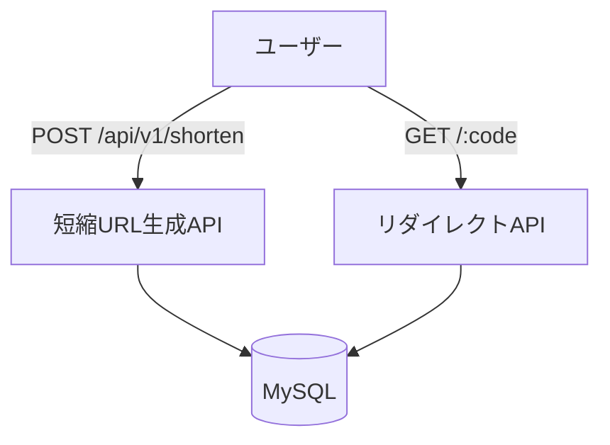
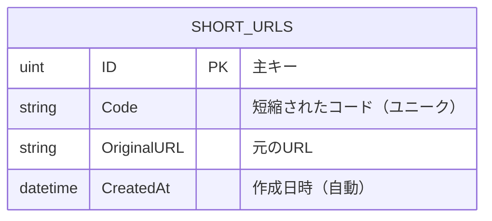

# 🔗 shorty-link
※ 下記はGitHub Actions による CI / Test / Lint 結果（main ブランチ）

[](https://github.com/SI-Monxy/shorty-link/actions/workflows/go-ci.yml)
[](https://github.com/SI-Monxy/shorty-link/actions/workflows/go-test.yml)
[](https://github.com/SI-Monxy/shorty-link/actions/workflows/go-lint.yml)

短縮URLを生成・管理するAPIサーバーです。Go（Gin）をベースに、**クリーンアーキテクチャ**や**Docker**、**GORM**などのモダンな技術を用いて構築しました。

本プロジェクトは、**Go×クリーンアーキテクチャ×CI/CD×IaC**のスキル可視化を目的としたポートフォリオ個人開発プロジェクトです。

## 🚀 特徴・構成

- ✅ 短縮URLの生成／リダイレクト
- ✅ クリーンアーキテクチャによる責務分離
- ✅ GORM × MySQL によるDB永続化
- ✅ Swagger UIでAPI仕様を可視化
- ✅ ユニットテスト対応（UseCase／Presenter）
- ✅ Docker Composeで即時ローカル起動
- ✅ GitHub ActionsによるCI/CDパイプライン
- 🔜 TerraformによるIaC構築

## ⚙️ 使用技術

| 分類         | 技術                           |
|--------------|--------------------------------|
| 言語         | Go 1.24                        |
| Web          | Gin                            |
| DB           | MySQL 8（Docker）              |
| ORM          | GORM                           |
| アーキテクチャ | クリーンアーキテクチャ         |
| 開発環境     | Docker / Docker Compose        |
| API設計      | REST / Swagger (OpenAPI 2.0)   |
| テスト       | Go標準 + Testify               |
| CI/CD        | GitHub Actions     |
| IaC          | Terraform（導入予定）          |


## 🧪 実装済みAPI

### ✅ POST `/api/v1/shorten`

**URLを短縮するAPI**

#### 📥 リクエスト
```json
{
  "original_url": "https://example.com"
}
```

#### 📤 レスポンス
``` json
{
  "short_url": "http://localhost:8080/abc123"
}
```

### ✅ GET `/:code`

**短縮URLにアクセスすると元のURLにリダイレクトします**

#### 📤 レスポンス
```
HTTP/1.1 302 Found
Location: https://example.com
```

## 📚 APIドキュメント（Swagger）

自動生成されたOpenAPI仕様のSwagger UIが利用可能です。

- Swagger UI: [http://localhost:8080/swagger/index.html](http://localhost:8080/swagger/index.html)

### 使用ライブラリ

- [swaggo/swag](https://github.com/swaggo/swag)
- [swaggo/gin-swagger](https://github.com/swaggo/gin-swagger)

### ドキュメント生成コマンド

```bash
swag init --dir ./cmd/server,./internal/interface/handler/http --output ./docs --parseDependency --parseInternal
```


## 🛠 ローカル環境構築
```
# リポジトリをクローン
git clone https://github.com/SI-Monxy/shorty-link.git

# プロジェクトに移動
cd shorty-link

# Dockerで起動
docker compose up --build
```


## 📁 ディレクトリ構成（抜粋）
```
shorty-link/
├── cmd/                    # エントリポイント（main）
├── internal/              # アプリ本体（クリーンアーキテクチャ）
│   ├── config/            # DB接続設定
│   ├── domain/            # エンティティ、リポジトリIF
│   ├── usecase/           # 入出力DTO、ユースケース、IF
│   ├── presenter/         # 出力整形ロジック
│   ├── interface/handler/ # Ginハンドラ層
│   └── infrastructure/db/ # GORMモデル、MySQL実装
├── docs/                  # Swagger生成ファイル
├── docker/                # Dockerfile
├── docker-compose.yml
└── README.md
```

## 🗂 データ構造と設計図
#### 🧑‍🏫 ユースケース図（Mermaid）


#### 🗄 ER図（Mermaid）


## 🧪 テスト
```
# 全テスト実行
go test ./...

# 特定ファイルのテスト実行
go test ./internal/usecase/shorturl
```

- ✅ UseCase（Interactor）に対するテスト実装済み
- ✅ Presenterの出力変換ロジックのテストあり
- ✅ Handler層のGinルーティング含む統合テストも実施可能

## 🔁 CI/CD

本プロジェクトでは GitHub Actions による継続的インテグレーションを導入しています。

- ✅ **go-ci**: ビルドとユニットテストを自動実行
- ✅ **go-test**: プッシュやPR時に全テストを自動実行
- ✅ **go-lint**: `staticcheck` による静的解析を自動実行

ワークフローは `.github/workflows` ディレクトリに格納されています。

## 🧪 今後の実装予定（TODO）
- カスタム短縮コード対応（任意エイリアス）
- URLの有効期限設定（TTL）
- アクセスログ記録（日時/IP/UAなど）
- アクセス分析API（クリック数の集計）
- TerraformによるIaC構築とCloud環境デプロイ


## 🧑‍💻 開発者
Shimon Iwata

GitHub: [@SI-Monxy](https://github.com/SI-Monxy)

X (旧Twitter): [@SI-Monxy](https://x.com/SI_Monxy)

## 📄 ライセンス
MIT License
